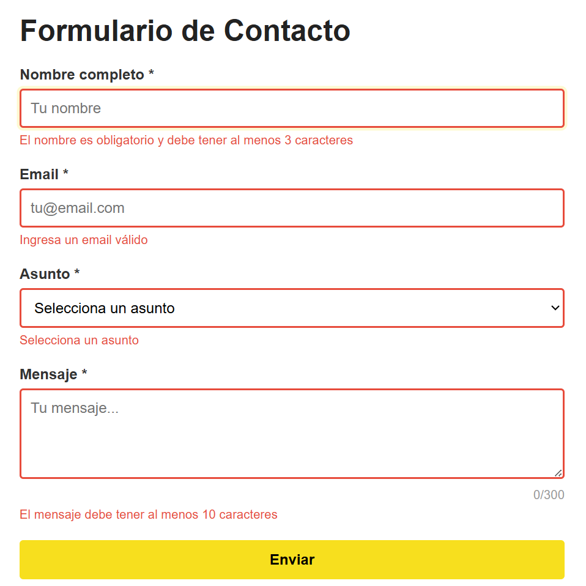
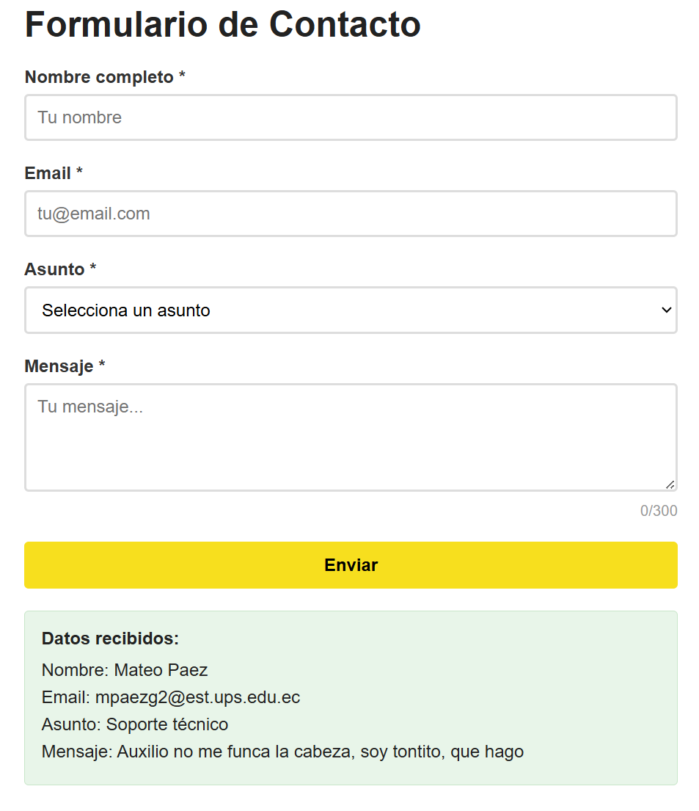
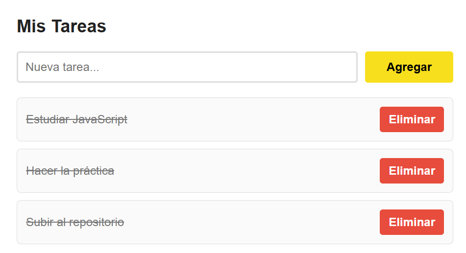
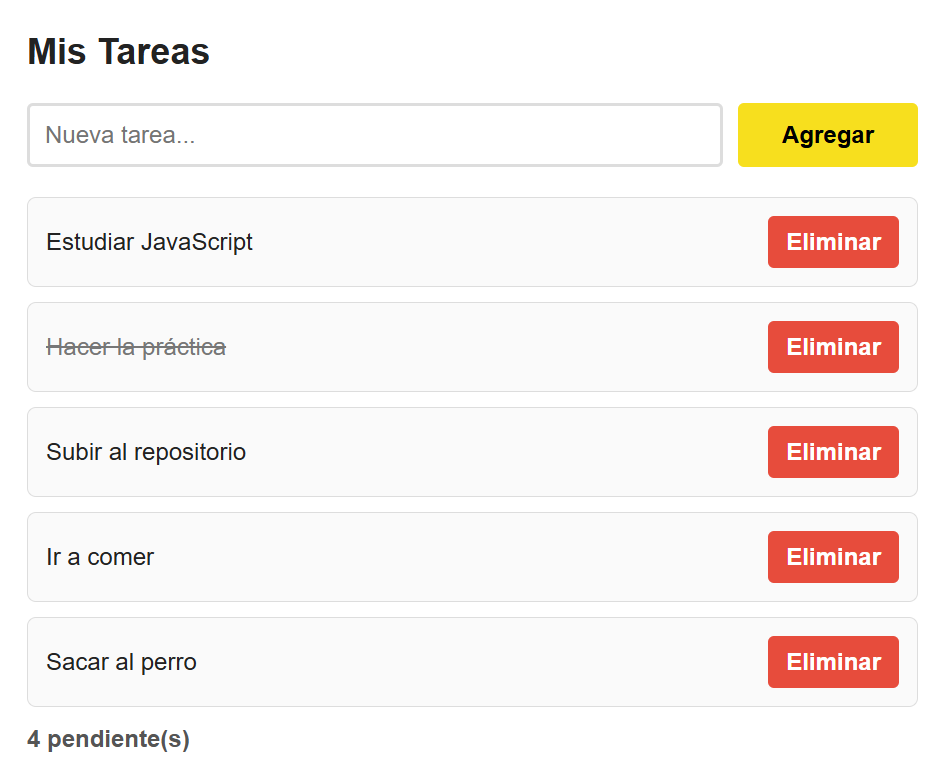
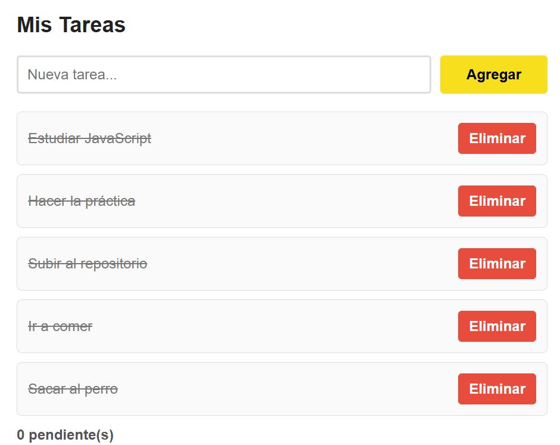

# Práctica 03 - Eventos y Formularios
#### Mateo Páez - Programación Web

## 1. Descripción breve de la solución
Esta aplicación web se divide en dos módulos principales centrados en el manejo de eventos en el DOM. El primero es un formulario de contacto con validación de datos en tiempo real y prevención del comportamiento por defecto al enviar. El segundo es un gestor de tareas interactivo que utiliza la delegación de eventos para optimizar el rendimiento al marcar tareas como completadas o eliminarlas, manteniendo actualizado de forma dinámica un contador de elementos pendientes.

## 2. Fragmentos de código relevantes

### 2.1 Validación de formulario con preventDefault()
Se intercepta el evento `submit` del formulario para evitar la recarga de la página. Se validan los campos individuales y, de ser correctos, se procesa la información.

```javascript
formulario.addEventListener('submit', (e) => {
  e.preventDefault();

  const nombreValido = validarNombre();
  const emailValido = validarEmail();
  const asuntoValido = validarAsunto();
  const mensajeValido = validarMensaje();

  if (nombreValido && emailValido && asuntoValido && mensajeValido) {
    mostrarResultado();
    resetearFormulario();
    return;
  }

  if (!nombreValido) {
    inputNombre.focus();
    return;
  }
  if (!emailValido) {
    inputEmail.focus();
    return;
  }
  if (!asuntoValido) {
    selectAsunto.focus();
    return;
  }
  textMensaje.focus();
});
```

### 2.2 Event delegation en la lista de tareas
Se asigna un solo listener al contenedor padre (`#lista-tareas`). Mediante `e.target.dataset.action`, se identifica si la acción corresponde a eliminar o cambiar el estado de la tarea.

```javascript
listaTareas.addEventListener('click', (e) => {
  const action = e.target.dataset.action;

  if (!action) {
    return;
  }

  const item = e.target.closest('li');
  if (!item || !item.dataset.id) {
    return;
  }

  const id = Number(item.dataset.id);

  if (action === 'eliminar') {
    tareas = tareas.filter((tarea) => tarea.id !== id);
    renderizarTareas();
    return;
  }

  if (action === 'toggle') {
    const tarea = tareas.find((itemTarea) => itemTarea.id === id);
    if (tarea) {
      tarea.completada = !tarea.completada;
      renderizarTareas();
    }
  }
});
```

### 2.3 Atajo de teclado con Ctrl+Enter
Se implementa un listener global para capturar la combinación de teclas `Ctrl + Enter` y forzar el envío del formulario.

```javascript
document.addEventListener('keydown', (e) => {
  if (e.ctrlKey && e.key === 'Enter') {
    e.preventDefault();
    formulario.requestSubmit();
  }
});
```

## 3. Imágenes de la Aplicación

### Validación en acción


### Formulario procesado


### Event delegation funcionando


### Contador de tareas actualizado


### Tareas completadas
