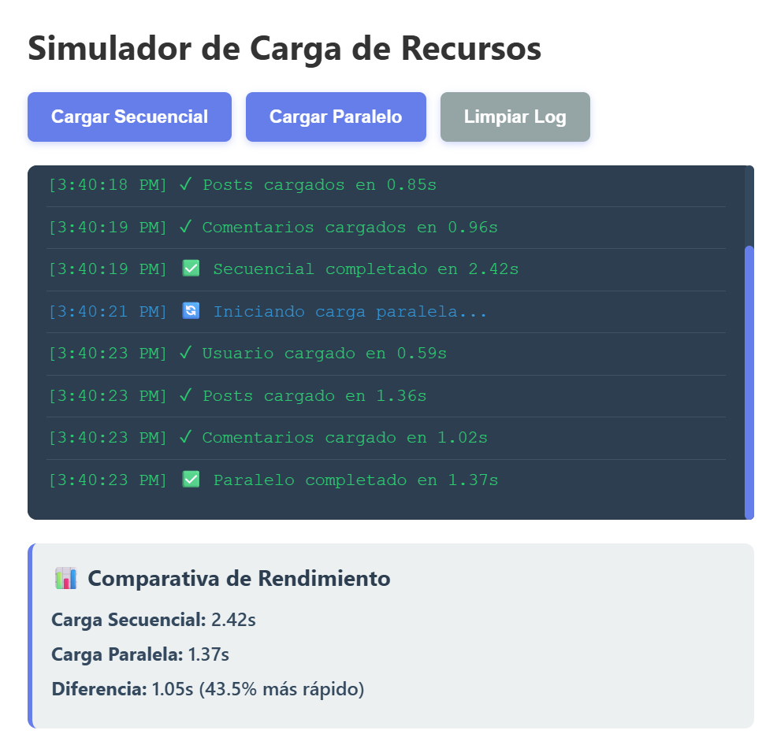
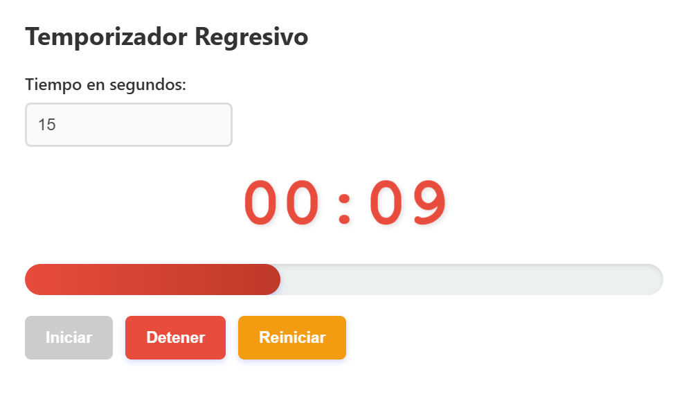
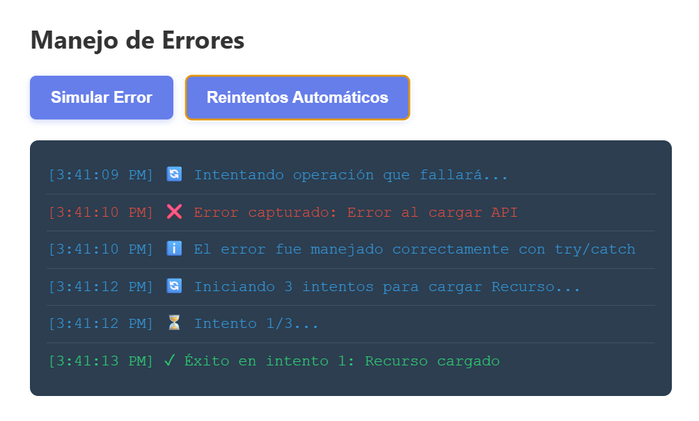

# Práctica 05 - Asincronía
#### Mateo Páez - Programación Web

## 1. Descripción breve del simulador implementado
Esta aplicación web es un simulador interactivo que demuestra de forma práctica el manejo de la asincronía en JavaScript. Permite visualizar en tiempo real la diferencia de rendimiento entre cargar recursos de forma secuencial frente a una carga paralela. Además, integra un temporizador regresivo visual con barra de progreso dinámica y demuestra el manejo de errores asíncronos controlados implementando simulaciones de fallos y un sistema de reintentos automáticos.

## 2. Análisis de la diferencia de tiempo entre carga secuencial y paralela
La carga secuencial ejecuta cada petición asíncrona una tras otra. El sistema espera a que el recurso actual termine de cargar por completo antes de iniciar la solicitud del siguiente, sumando el tiempo de todas las peticiones. En contraste, la carga paralela dispara todas las solicitudes de manera simultánea utilizando Promise.all. Gracias a esto, el tiempo total de ejecución equivale aproximadamente al de la petición individual más lenta, haciendo el proceso mucho más rápido.

## 3. Fragmentos de código relevantes

### 3.1 Función que retorna promesa con setTimeout
```javascript
function simularPeticion(nombre, tiempoMin = 500, tiempoMax = 2000, fallar = false) {
  return new Promise((resolve, reject) => {
    const tiempoDelay = Math.floor(Math.random() * (tiempoMax - tiempoMin + 1)) + tiempoMin;
    setTimeout(() => {
      if (fallar) {
        reject(new Error(`Error al cargar ${nombre}`));
      } else {
        resolve({ nombre, tiempo: tiempoDelay, timestamp: new Date().toLocaleTimeString() });
      }
    }, tiempoDelay);
  });
}
```

### 3.2 Carga secuencial con await consecutivos
```javascript
async function cargarSecuencial() {
  try {
    const usuario = await simularPeticion('Usuario', 500, 1000);
    const posts = await simularPeticion('Posts', 700, 1500);
    const comentarios = await simularPeticion('Comentarios', 600, 1200);
  } catch (error) {
    mostrarLog(`Error: ${error.message}`, 'error');
  }
}
```

### 3.3 Carga paralela con Promise.all
```javascript
async function cargarParalelo() {
  try {
    const promesas = [
      simularPeticion('Usuario', 500, 1000),
      simularPeticion('Posts', 700, 1500),
      simularPeticion('Comentarios', 600, 1200)
    ];
    const resultadosPromesas = await Promise.all(promesas);
  } catch (error) {
    mostrarLog(`Error: ${error.message}`, 'error');
  }
}
```

### 3.4 Manejo de errores con try/catch
```javascript
async function simularError() {
  try {
    await simularPeticion('API', 500, 1000, true);
  } catch (error) {
    mostrarLogError(`Error capturado: ${error.message}`, 'error');
  }
}

### 3.5 Temporizador con setInterval
function iniciar() {
  intervaloId = setInterval(() => {
    tiempoRestante--;
    actualizarDisplay();
    if (tiempoRestante <= 0) {
      detener();
      display.classList.add('alerta');
      alert('¡Tiempo terminado!');
    }
  }, 1000);
}
```

## 4. Capturas

### Comparativa secuencial vs paralelo con tiempos


### Temporizador funcionando con barra de progreso


### Error capturado y mostrado en UI
