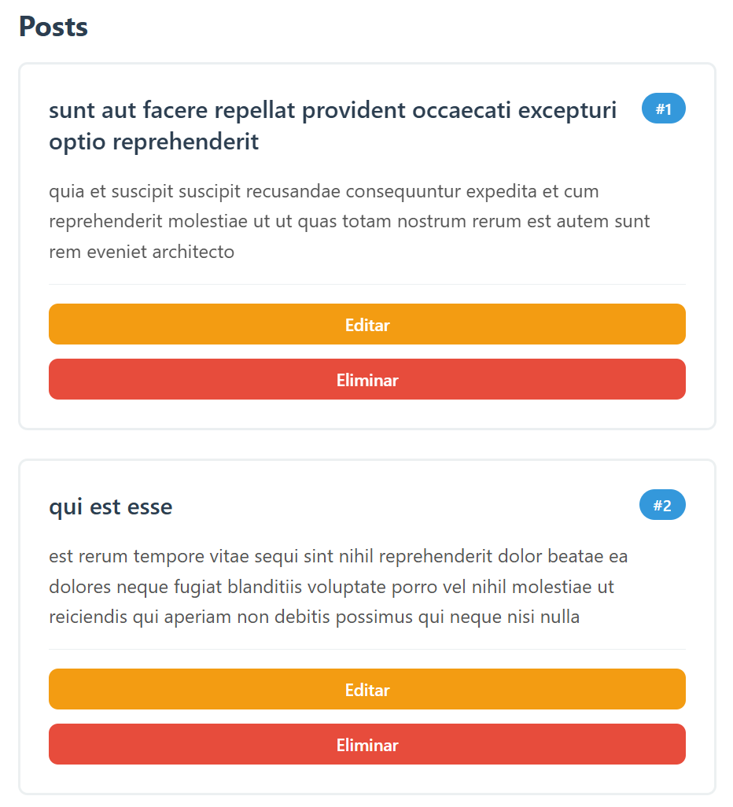
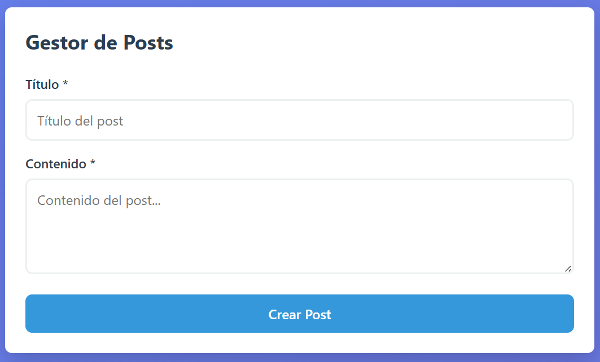
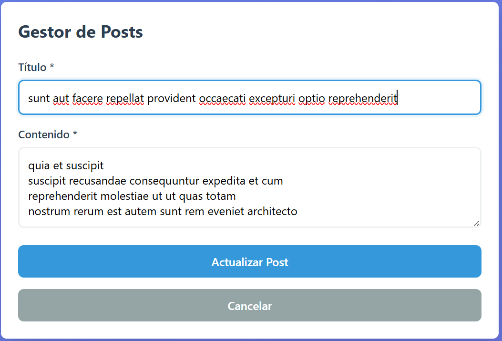
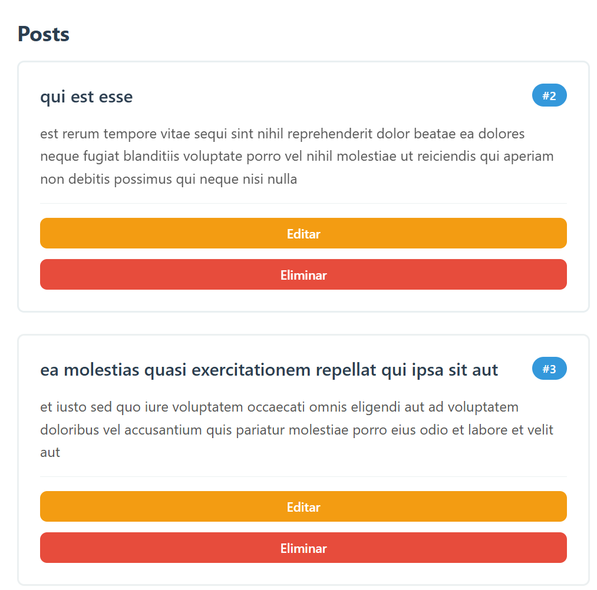
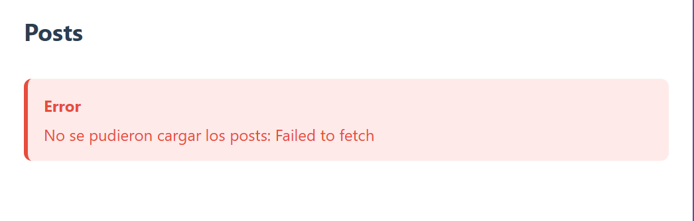
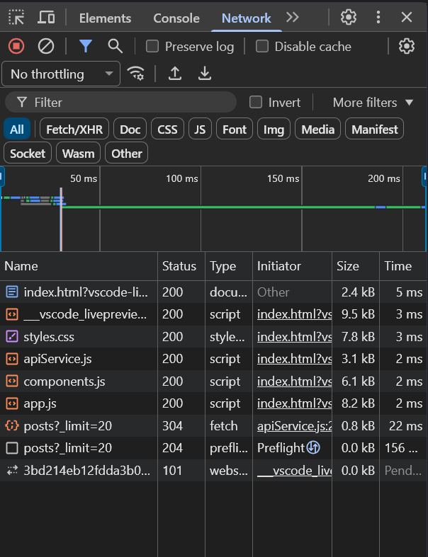
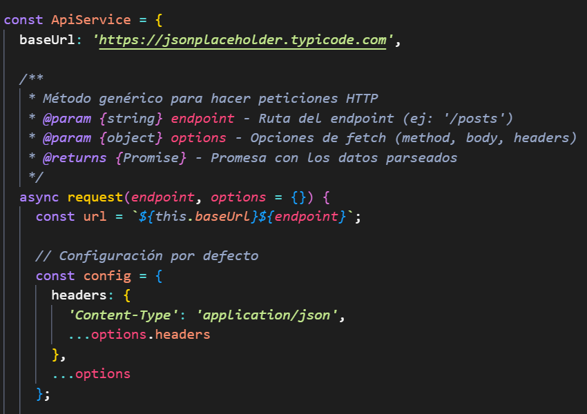

# Proyecto CRUD con API

Este proyecto implementa una aplicación web con consumo de API, separando la lógica del servicio y cumpliendo con operaciones CRUD completas. Además, incluye manejo visual de estados como carga y errores.

---

## Características

- Servicio API separado en su propio archivo
- Operaciones CRUD completas:
  - GET (obtener datos)
  - POST (crear registros)
  - PUT (actualizar registros)
  - DELETE (eliminar registros)
- Spinner de carga mientras se realizan peticiones
- Manejo de errores visual para el usuario
- Uso de DevTools para validación de requests HTTP

---

## Estructura del Proyecto
/project
│── /assets # Capturas de pantalla
│── /components # Componentes de la aplicación
│── /services
│ └── api.js # Servicio API (fetch / axios)
│── index.html
│── app.js
│── styles.css
│── README.md

---

## Servicio API

El servicio API está desacoplado en un archivo independiente (`api.js`), donde se centralizan todas las peticiones HTTP.

Ejemplo de operaciones:

- `getItems()` → GET
- `createItem(data)` → POST
- `updateItem(id, data)` → PUT
- `deleteItem(id)` → DELETE

Esto permite:
- Reutilización de código
- Mejor mantenimiento
- Separación de responsabilidades

---

## Operaciones CRUD

| Operación | Método HTTP | Descripción |
|----------|------------|------------|
| Obtener datos | GET | Carga la lista desde la API |
| Crear | POST | Agrega un nuevo elemento |
| Editar | PUT | Modifica un elemento existente |
| Eliminar | DELETE | Remueve un elemento |

---

## Manejo de Estados

### Spinner de carga
Se muestra mientras se realiza una petición a la API.

### Manejo de errores
- Mensajes visuales cuando falla una petición
- Evita que la app falle silenciosamente
- Mejora la experiencia del usuario

---

## Evidencias (Capturas)

### 1. Datos cargados desde la API
  
**Descripción:** Se obtienen N registros desde la API mediante una petición GET y se renderizan dinámicamente en la página.

---

### 2. Crear elemento
  
**Descripción:** Se envía un formulario mediante POST y el nuevo elemento aparece en la lista sin recargar la página.

---

### 3. Editar elemento
  
**Descripción:** Se modifica un registro existente mediante PUT y el cambio se refleja en la interfaz.

---

### 4. Eliminar elemento
  
**Descripción:** Se elimina un elemento mediante DELETE y desaparece de la lista en tiempo real.

---

### 5. Manejo de errores
  
**Descripción:** Se muestra un mensaje visual cuando ocurre un error en la petición (ej: servidor no disponible).

---

### 6. DevTools - Network
  
**Descripción:** En la pestaña Network se observan las peticiones HTTP (GET, POST, PUT, DELETE), incluyendo estado, tiempo de respuesta y payload.

---

### 7. Código
  
**Descripción:** Capturas del servicio API y de los componentes donde se consumen los datos.

---

## Validación

- ✔️ Todas las operaciones CRUD funcionan correctamente
- ✔️ Las peticiones HTTP son visibles en DevTools
- ✔️ La UI responde a estados de carga y error
- ✔️ Código modular y organizado

---

## Notas

- Se recomienda usar herramientas como **Fetch API** o **Axios**
- Verificar siempre `response.ok` en las peticiones
- Manejar errores con `try/catch`
- Mantener la separación entre lógica de datos y UI

---

## Autor

Proyecto desarrollado como práctica de consumo de APIs y manejo de operaciones CRUD en frontend.