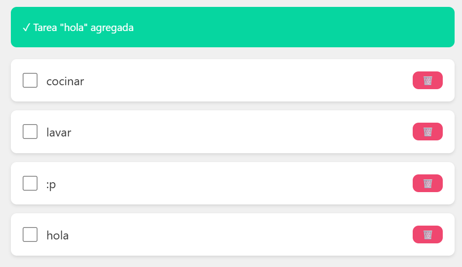
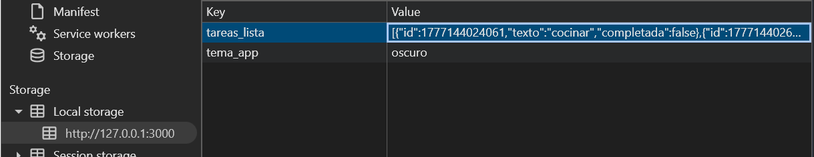
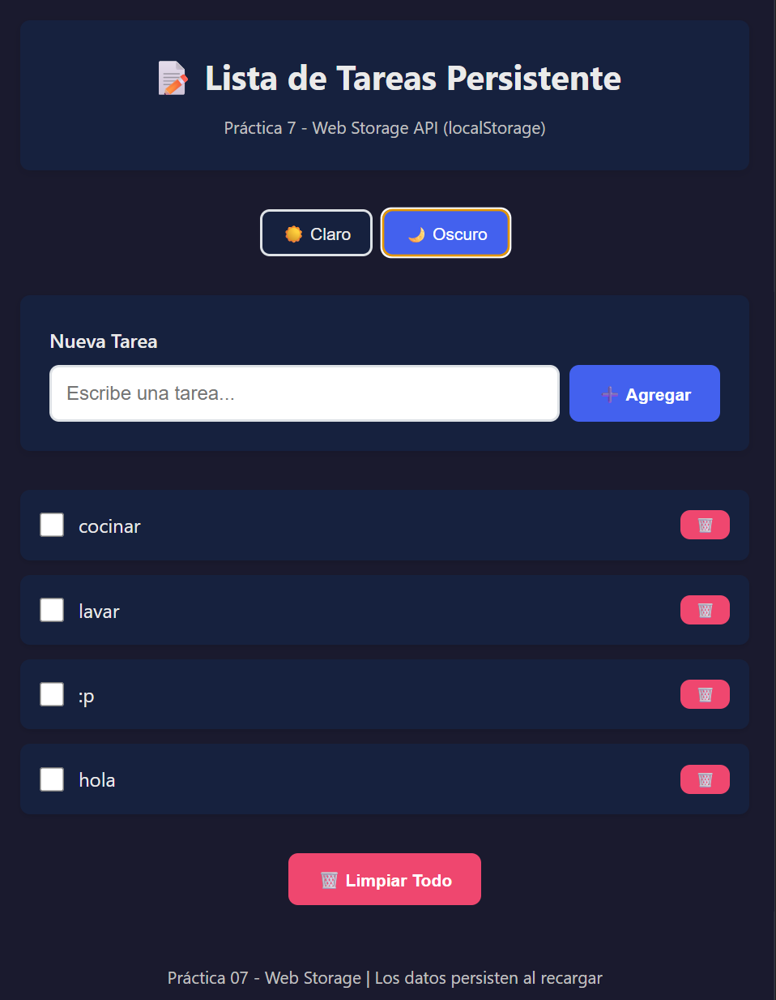
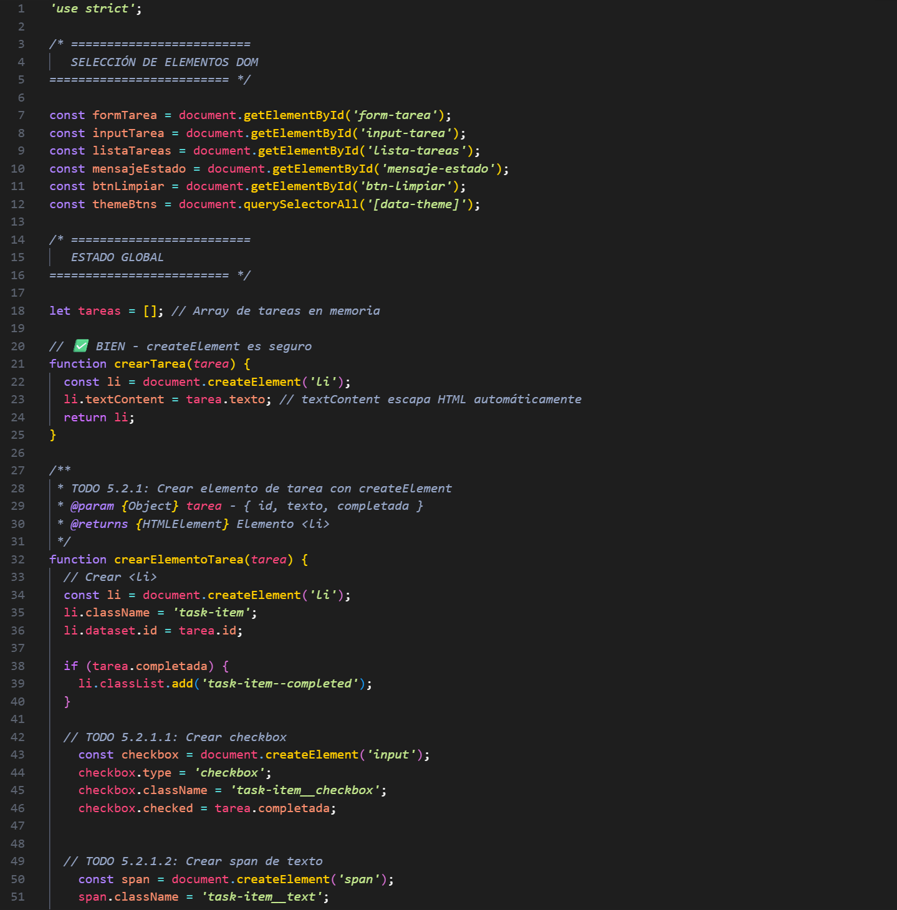
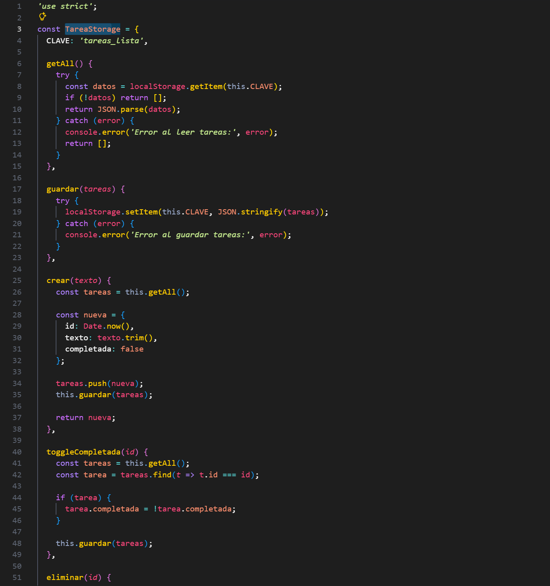

# Proyecto: Lista de Tareas Persistente (Web Storage API)

Este proyecto implementa una aplicación de gestión de tareas (To-Do List) que utiliza la **Web Storage API** para garantizar que los datos y la configuración de la interfaz (tema) persistan incluso después de recargar la página o cerrar el navegador.

---

## Características

- **Servicio de Almacenamiento Modular**: Lógica de persistencia desacoplada en `storage.js`.
- **Operaciones CRUD Completas**:
  - **Create**: Creación de tareas con ID único (timestamp).
  - **Read**: Recuperación y renderizado dinámico de la lista.
  - **Update**: Cambio de estado (completada/pendiente).
  - **Delete**: Eliminación individual y limpieza total.
- **Persistencia de Tema**: El modo claro/oscuro se guarda y aplica automáticamente al iniciar.
- **Manipulación Segura del DOM**: Construcción de elementos mediante `createElement` y `textContent` para evitar ataques XSS.

---

## Estructura del Proyecto

```
/07-storage
├── index.html
├── css/
│     └── styles.css
├── js/
│     └── app.js
│     └── storage.js
├── assets/
│     ├── 01-lista.png
│     ├── 02-devtools.png
│     ├── 03-oscuro.png
│     └── 04-codigo.png
└── README.md
```
---

## Servicio de Storage

El archivo `storage.js` actúa como el motor de persistencia. Utiliza `JSON.parse` y `JSON.stringify` para manejar el array de objetos en `localStorage`.

- `TareaStorage.getAll()`: Recupera el listado actual.
- `TareaStorage.crear(texto)`: Instancia un nuevo objeto tarea.
- `TemaStorage.setTema(tema)`: Guarda la preferencia visual del usuario.

---

## Operaciones CRUD

| Operación | Método en Código | Descripción |
|----------|------------|------------|
| **Crear** | `TareaStorage.crear()` | Agrega un objeto con `id`, `texto` y `completada: false`. |
| **Leer** | `renderizarTareas()` | Limpia el contenedor y genera la lista desde el storage. |
| **Actualizar**| `toggleCompletada()` | Invierte el estado booleano de la tarea seleccionada. |
| **Eliminar** | `eliminar()` / `limpiarTodo()` | Remueve elementos específicos o vacía el storage. |

---

## Manipulación del DOM

Para garantizar la seguridad, no se utiliza `innerHTML` para insertar contenido dinámico. En su lugar:
1. Se crean los nodos con `document.createElement('li')`.
2. Se asignan clases con `className`.
3. Se inserta el texto de forma segura con `textContent`.

---

## Evidencias (Capturas)

### 1. Lista con datos persistentes
  
**Descripción:** Se visualizan múltiples tareas creadas. Al recargar el navegador, el estado de las tareas (texto y checkbox) se mantiene intacto gracias a la carga inicial desde el storage.

---

### 2. DevTools - Local Storage
  
**Descripción:** En la pestaña **Application > Local Storage**, se observa la clave `tareas_lista` almacenando el array de objetos en formato JSON.

---

### 3. Tema Oscuro Persistente
  
**Descripción:** Aplicación del modo oscuro mediante la manipulación de variables CSS (`setProperty`). La preferencia se guarda bajo la clave `tema_app`.

---

### 4. Código (Implementación)
  
**Descripción:** Vista de los archivos `storage.js` y `app.js` mostrando el uso de métodos de array como `filter` y `find` para gestionar los datos.

  


---

## Validación

- ✔️ Persistencia total de datos al recargar.
- ✔️ Uso de `localStorage` para tareas y temas.
- ✔️ Renderizado seguro mediante `createElement`.
- ✔️ Interfaz responsiva y manejo de estados vacíos.

---

## Autor - Mateo Paez
Proyecto desarrollado como práctica de persistencia de datos en el cliente y manipulación avanzada del DOM.