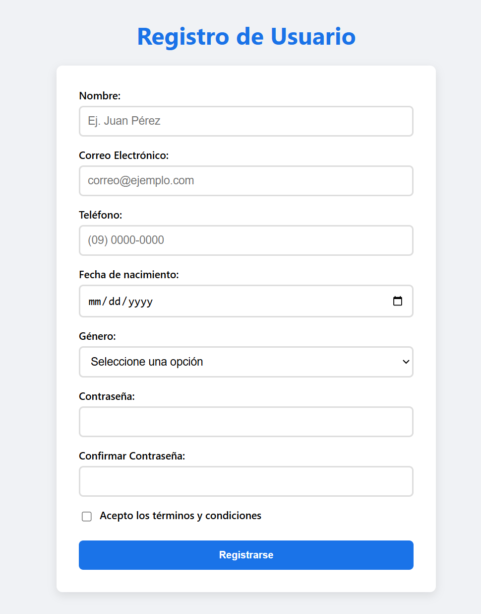
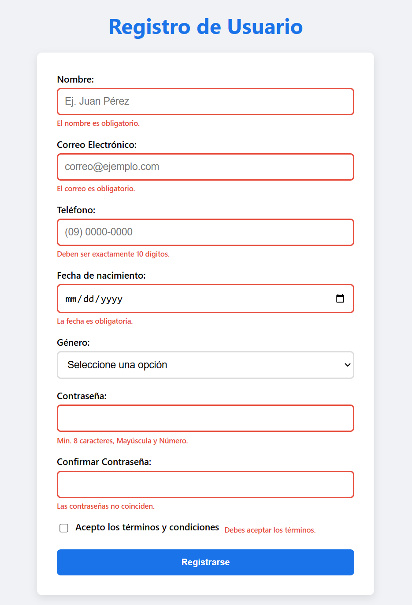
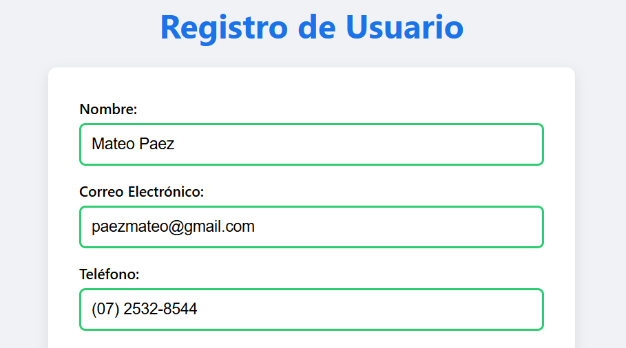
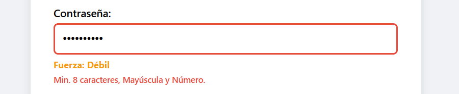
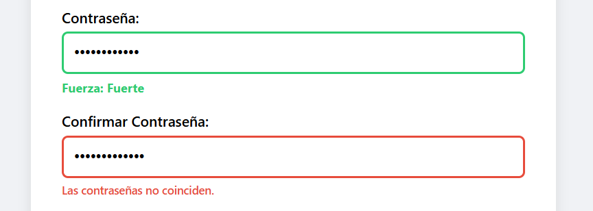
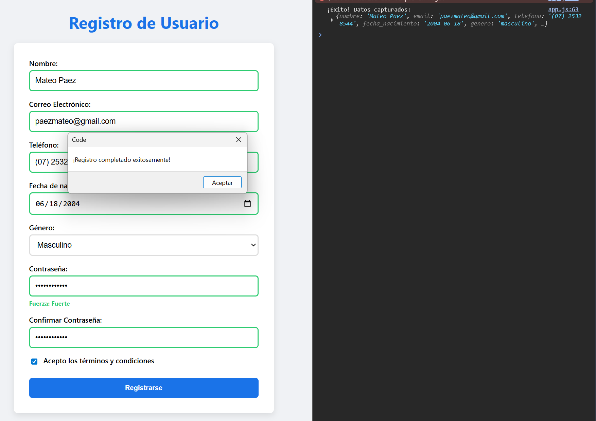

# Proyecto: Formulario Avanzado con Validación en Tiempo Real

Este proyecto implementa un formulario web completo con validaciones personalizadas en tiempo real, feedback visual y manejo de datos mediante **FormData**. Se prioriza el control manual del flujo de validación y la experiencia del usuario.

---

## Características

- **Formulario con múltiples campos (>= 8)**:
  - Nombre
  - Apellido
  - Email
  - Teléfono
  - Usuario
  - Contraseña
  - Confirmación de contraseña
  - Checkbox de términos

- **Validación en Tiempo Real**:
  - Eventos `input` y `focusout`
  - Evaluación inmediata del estado del campo

- **Feedback Visual**:
  - Bordes dinámicos (rojo/verde)
  - Mensajes de error personalizados
  - Indicador de fuerza de contraseña

- **Recolección de Datos**:
  - Uso de `FormData`
  - Conversión a objeto con `Object.fromEntries`

---

## Estructura del Proyecto
```
/08-formularios-validacion
├── index.html
├── css/
│ └── styles.css
├── js/
│ └── app.js
│ └── validacion.js
├── assets/
│ ├── 01-vacio.png
│ ├── 02-errores.png
│ ├── 03-valido.png
│ ├── 04-password.png
│ ├── 05-confirmacion.png
│ ├── 06-exito.png
└── README.md
```


---

## Validación Personalizada

El formulario desactiva la validación nativa del navegador:

- `novalidate` en `<form>`
  - Permite controlar completamente la lógica de validación desde JavaScript.

---

## Eventos de Validación

- `input`: valida mientras el usuario escribe.
- `focusout`: valida cuando el usuario abandona el campo.

Diferencia clave:
- `focusout` **burbujea** → permite delegación de eventos.
- `blur` **no burbujea** → menos flexible.

---

## Expresiones Regulares

Las validaciones usan expresiones regulares evaluadas con:

- `.test(valor)`
  - Retorna `true` o `false`.

Ejemplo:
- Email válido
- Contraseña segura

---

## Manejo de Errores

- `setCustomValidity('mensaje')`: marca el campo como inválido
- `setCustomValidity('')`: limpia el error (vuelve válido)

Esto permite integrarse con el estado de validación del navegador sin usar su UI por defecto.

---

## Uso de FormData

- `new FormData(form)`
  - Recopila todos los campos con atributo `name`.

- `Object.fromEntries(new FormData(form))`
  - Convierte los datos a objeto.

Limitaciones:
- No incluye **checkboxes no marcados**

Solución:
- Verificación manual:
```
form.querySelector('[name="terminos"]').checked
```


---

## Validaciones Implementadas

- Campos obligatorios
- Formato de email
- Longitud mínima de contraseña
- Fuerza de contraseña (regex progresivo)
- Coincidencia de contraseñas
- Aceptación de términos

---

## Feedback Visual

- Clase `.error` → borde rojo
- Clase `.valido` → borde verde
- Mensajes dinámicos por campo
- Indicador de fuerza de contraseña:
- Débil
- Media
- Fuerte

---

## Evidencias (Capturas)

### 1. Formulario vacio - Vista inicial

**Descripcion:** El formulario se muestra sin interacción. Todos los campos están en estado neutro sin validaciones activadas.

---

### 2. Errores de validacion

**Descripcion:** Al interactuar y salir de los campos (`focusout`), se muestran errores específicos con bordes rojos y mensajes personalizados.

---

### 3. Campos validos

**Descripcion:** Los campos correctamente completados cambian a borde verde indicando validación exitosa en tiempo real.

---

### 4. Fuerza de contraseña

**Descripcion:** Indicador dinámico basado en regex que evalúa la complejidad de la contraseña (longitud, mayúsculas, números, símbolos).

---

### 5. Confirmacion password

**Descripcion:** Se valida que ambas contraseñas coincidan. En caso contrario, se muestra error inmediato.

---

### 6. Envio exitoso

**Descripcion:** Formulario válido, datos recolectados con `FormData` y mostrados en consola. Se presenta mensaje de éxito.

---

## Flujo de Validación

1. Usuario ingresa datos
2. Evento `input` valida en tiempo real
3. Evento `focusout` refuerza validación
4. Se actualiza UI (error/valido)
5. En submit:
 - Se verifica todo el formulario
 - Se usa `FormData`
 - Se procesa información

---

## Validación

- ✔️ Validación completamente personalizada
- ✔️ Feedback visual inmediato
- ✔️ Uso correcto de eventos (`input`, `focusout`)
- ✔️ Manejo manual de errores con `setCustomValidity`
- ✔️ Recolección de datos con `FormData`
- ✔️ Manejo correcto de checkboxes

---

## Autor - Mateo Paez
Proyecto desarrollado como práctica de validación avanzada de formularios, manipulación del DOM y control de eventos en JavaScript.